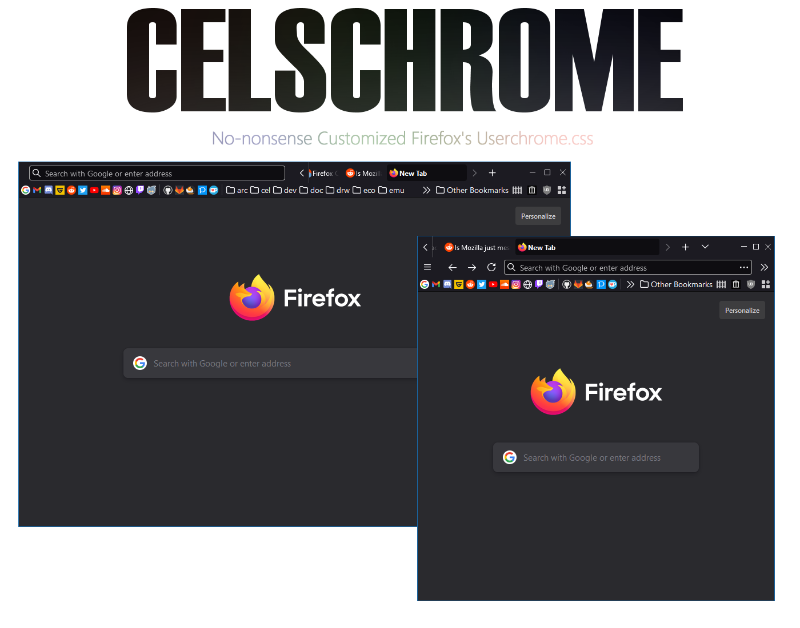

# Celschrome - Cel's userchrome.css  

Heavily Customized Personal UserChrome CSS for Firefox 64+ Version.
  

What is [userchrome.css?](https://www.userchrome.org/)

## Features

This css is inspired from most userchrome.css tweaks repos, including the one-liner mod ,auto-hide close button and auto-hide navigation buttons.

- [SimplerentFox](https://github.com/migueravila/SimplerentFox)  
- [CustomCSSforFx](https://github.com/Aris-t2/CustomCSSforFx)  

### Overall Tweaks

- Colorless Theme. (uses the color from Windows Personalization Setting)
- ~~*RGB*~~ `deprecated since Firefox v69`

### Navigation Tweaks  

- Allows One-Liner Compact Mode (Address Bar + Tab) when Browser window is over certain size.
- Tab auto-size focus with auto-hide close button.
- Address Bar auto-expand and auto-hide when hovered. (buggy)  
- Reduce most* spaces in tabs, navigations and bookmark bar for more compact footprint `*not including window buttons.`  

### Personal Bar Tweaks  

- ~~Transparent Background color in bookmark folder.~~ `idk what happened lmao`  
- ~~Auto-Hide Personal Bar.~~ `dropped support, may readded in the future`

---

## Prerequisite  

Go to `about:config` in Firefox and do the following :  

- Set `toolkit.legacyUserProfileCustomizations.stylesheets` to `true`.  
- ~~(Optional) Set `layout.css.backdrop-filter.enabled` to `true`.~~ `default to true on v106`  

## Installing  

Download `chrome.zip` from [latest release](https://github.com/koushiroue/celschrome/releases/latest) and extract it to your Firefox profile folder.
Go to `about:profiles` to check the location of the folder.

